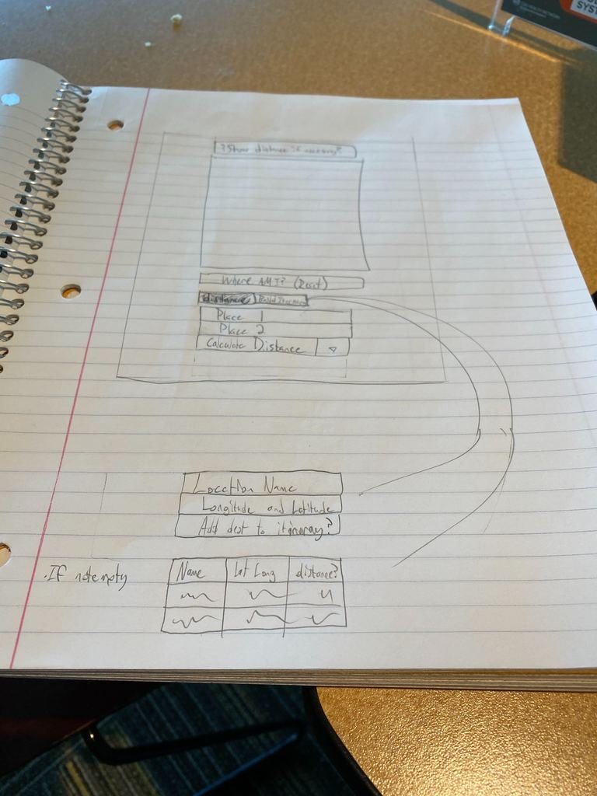

# Sprint 3 - *t03* - *Hugh-Lit Pack-Herd*

## Goal: Build a trip!
### Sprint Leader: *Axel Wahlstrom*

## Definition of Done

* The version in `server/pom.xml` is `<version>3.0</version>`.
* The Product Increment release for `v3.0` created on GitHub.
* The team's web application is deployed on the production server (`black-bottle.cs.colostate.edu`).
* The design document is updated (`design.md`).
* The completed metrics are captured below.
* The scrums completed during each lecture are captured below.
* The sprint review and restrospective are captured below.

## Policies

### Mobile First Design
* Design for mobile, tablet, laptop, desktop in that order.
* Use ReactStrap and ReactLeaflet for a consistent user experience (no HTML, CSS, style, etc.).

### Clean Code
* Code Climate maintainability of A or B.
* Minimize code smells and duplication.

### Test Driven Development
* Write method headers, unit tests, and code in that order.
* Unit tests are fully automated.
* Maintain coverage at 50%.

### Processes
* Master is never broken. 
* All pull request builds and tests are successful on Travis-CI.
* All dependencies managed using Maven, npm, and WebPack.
* GitHub etiquette is followed always.

## Planned Epics

### Distance
    A few tasks from the distance epic still remain from sprint #2. The goal of distance epic is to
    use server-side computations to display the distance between 2+ points to the user. The only task
    which remains on this epic is to ensure the server port is correct when requesting server-side
    computations. A new Distance.js file will be created to help organize our code.
   
### Map
    Map is another epic which was carried over from sprint #2. The current goal for map is simply to
    give a better UI experience by centering the map on the line drawn by 2 given user points. The map
    epic should also be able to center the map correctly with any amount of n-points when n >= 2.
    
### Protocol Ver. 3
    Protocol Version 3 is an epic for sprint 3. This epic updates current server configurations, adding
    a trip response/request.json object for communicating with the server as well as creating a Trip.js class
    to help with code organization.
    
### More Destinations
    More Destinations epic is a very large epic this sprint. The goal of this epic is to create a method
    in order to store destinations in memory. It will also utilize our Distance.js file to display to users
    the total distance between their destinations. A few UI changes will also occur this epic; the main goals
    of the UI updates will be to allow users to enter a coordinate to add a point as well as an input box to allow
    users to name the point they chose. We will also make small adjustments to the PolyLine element to sketch a line
    between any number of points that the user may choose. We also potentially plan to implement a shortest route
    algorithm to handle dateline miscalculations and will also make our application a more user-friendly environment.
    
### Show Itenerary
    The Show Itenerary epic will add a new feature to the application which will alow users to create an itenerary for their
    trip. The epic will update UI to allow users to view their current trip. The employment of cookies in this epic will
    save the state of the user's itenerary for future use if the user decides to leave the page and come back later.
    
### Load
    The goal of the Load epic is to allow the application to load any saved trips in a CSV/JSON format in order for
    users to share trips with eachother or to have a portable copy of their trip. This epic will also update UI in order
    for users to click a button and load a file from their file browser.
    
## Planning

* Our team met a few times this week to workout the logistics of Sprint 3. The meetings were very progressive, allowing everyone to convey their opinions on the goals of the sprint. Below are a few images generated by our meeting, and after discussion we decided to go with the tasks enumerated in the images below. We have a very concise path and some tasks to get us started in the right direction. Additionally, we also have a very basic sketch of how we imagine our user interface layout.

## Metrics

| Statistic | # Planned | # Completed |
| --- | ---: | ---: |
| Epics | *6* | *count* |
| Tasks |  *19*   | *count* | 
| Story Points |  *29*  | *sum* | 

## Scrums

| Date | Tasks closed  | Tasks in progress | Impediments |
| :--- | :--- | :--- | :--- |
| *03-04-20* | *180, 187* | *205* |  | 
| *03-06-20* | *205* | *190, 186* |  |
| *03-09-20* | *186, 190, 215, 216* | *186, 188, 191* |  |
| *03-23-20* | *176, 196, 192* | *175, 188, 195, 226* |  |
| *03-25-20* | *175, 188, 194, 195, 197, 202, 222, 226* | *182, 189, 193* |  |

## Review

### Epics done

* **Map**: "Map" was a residual epic that remained from Sprint #2. The tasks in this epic included implementing map bounds in order for the Polyline drawn would be centered on the map. Another feature implemented during this epic was allowing the user to add more than 2 markers to the map, as a preamble for what later came to be Trip.js which handles the user's itinerary. During this epic, we also had to refactor Atlas.js in attempt to smoothen our progress down the road.
* **Distance**: "Distance" was another epic which remained from Sprint #2. This epic was relatively short. The main goal of this epic was to move Distance to its own file, Distance.js. Moving distance to its own file cleared up Atlas.js a lot and allowed for smoother development with Trip.js. We also needed to change the server port since our distance was on the default server port which resulted in mis-calculations.
* **Protocol V.3**: "Protocol V.3" was an epic for supporting the server. We created a trip request/response JSON with the server which allowed us to communicate with the server to do calculations server-side and displaying UI on the client-side.
* **More Destinations**: "More Destinations" was one of the larger epics this sprint. It involved not only letting users clicking to add more destinations but also typing coordinates to add another destination for their itineraries. This epic also implemented point naming which allows the user to name a point that they add, this would later be displayed in their itinerary. One task which we decided not to implement was the dateline, It was simply not high on our priority list and we never got around to implementing it.

### Epics not done 

### What went well
* Overall the general layout and design of our UI turned out really well. Although the UI design is not 100% polished yet, it still looks good. Also the functionality of everything and how everything works together is another thing that we are very proud of. Refactoring our project really helped us out in the long run and it was worth it.

### Problems encountered and resolutions
* One problem we encountered was refactoring our code. Everything about our code was so co-dependent on eachother since we initially wrote all of the distance functions inside of atlas.js which made it difficult to refactor. We collaborated on it though and how to refactor the project. We learned from our mistakes though to not throw a bunch of function into the same file and to create classes when necessary and appropriate.

## Retrospective

### What we changed this sprint
* Half way through the sprint we needed to rely on other means of communication such as Microsoft Teams to communicate which we all had to adjust to due to not being able to meet up in the lab. We learned that sprint planning is much more simple when meeting in person rather than over Microsoft Teams.

### What went well
* We work very strong as team. Whenever someone has a problem figuring something out everyone lends a hand to ensure the problem is solved. The four of us work together very well with lots of synergy.

### Potential improvements
* A potential improvement would be to have even more communication between the 4 of us. Considering the circumstances with the Corona virus we communicated pretty well, but as a team communication can always be improved.

### What we will change next time
* We will learn to work together over Microsoft Teams in order to complete the next two sprints. Although it is not ideal, it will work. It will be interesting learning to plan a sprint over Microsoft Teams but our team will adapt to the circumstance. 
