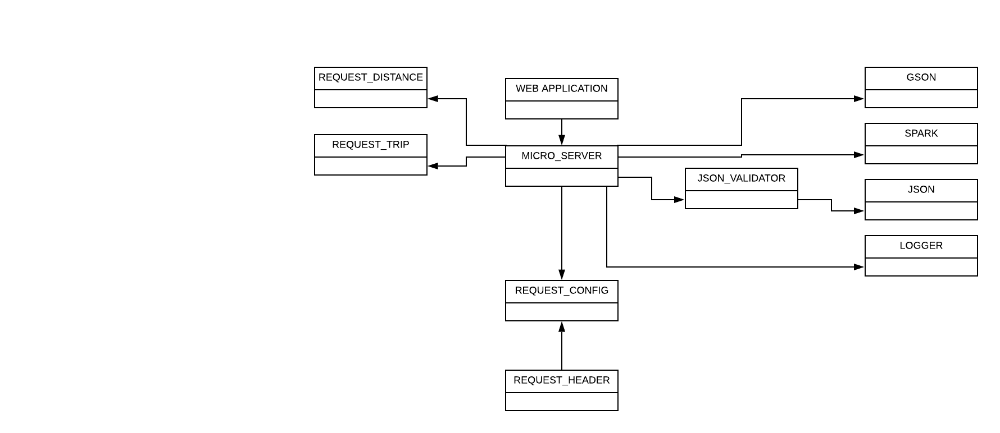

# Introduction

This document describes the architecture and design of a single page web application that interacts with microservices via RESTful APIs.
The key elements in this document include the architecture, user interface, client components, and server classes.

This is a living document that is updated as changes are made each sprint.
The initial document describes the Base code students are given as a starting point for the semester.
Students are expected to update this document as changes are made each sprint to reflect the evolution of their application and key decisions they make.
The Base section serves as an example.

# Base

The Base is a simple application to provide the architecture to the students at the beginning of the semester.
The JavaScript code will be useful examples for students to learn from and leverage in the code they write for sprint 1.
The progressive display of information using collapsible sections and popups will serve as examples of good user interface design.
The overall design is somewhat minimalist/simple for the intended mobile device audience.

### Architecture

The Base architecture is a JavaScript single page web application in an HTML5 browser that uses RESTful APIs to access Micro-services provided by a Java server running on Linux.
The client consists of a minimal index.html file that loads and executes the bundled JavaScript application.
The client and server files are bundled into a single JAR file for execution on the Linux server at a specified port.
The browser fetches the client files from the server on the specified port.

The browser loads the index.html file (by default) which in turn loads the bundled JavaScript single page application bundle.js.
* The single page application makes RESTful API requests to the server on the same port using  JavaScript's asynchronous fetch.  
* A protocol document describes the JSON format for the RESTful API requests and responses.
* JSON Schemas are used to verify requests on the server side and responses on the client side.
* On the client, ReactJS renders the application using ReactStrap, Leaflet, and application defined components.
* GSON is used on the server to convert JSON requests to Java objects and Java objects to JSON responses.
* The client (ulog) and server (SLF4J) logging mechanisms control debugging output during development and production - print statements and console logging should never be used. 

The following architecture elements are not included in the Base system.
They will be added later in the semester.
* Client filesystem .
* Server SQL .
* Server concurrency.

### User Interface

The basic screen in black shows the view on a mobile device, with a header, footer, and map.
The header contains a earth logo and the team name obtained from the server when the client was loaded.
The footer contains a connection icon along with the current server name and server URL the client is connected to.
The blue areas highlight the actions that may be performed.

Rather than buttons or icons to signify actions, we are associating actions with elements that are already on the screen to reduce the clutter.
We are using both popups and collapsible sections in this design rather than choosing to use one exclusively.
* Collapsible/Hidden sections are used for the map and about sections since they have a significant amount of content and we don't need to see them at the same time.
* A popup is used for the URL change since we want to control the interaction until the operation is completed. It seemed more natural than another collapsible section.

#### Clicking on the map places a marker.
Whenever a user clicks on the map, the client should display a marker with latitude and longitude at that location.
We only maintain a single marker at this point displaying the most recently clicked location.

#### Clicking on the team name should tell me more about the team.
Whenever a user clicks the team name in the header, a collapsible section should appear under the header with information about the team.
The collapsible map should disappear so only the about or map are displayed.
A close button / icon in the top right corner of the about will close the about and return the map to display.
A simple toggle in state should be able to control this rendering.
The about page should contain the team name as a heading, but be otherwise blank in base. 

#### Clicking on the URL in the footer should let me change the server.
Whenever a user clicks on the URL a popup should open showing the team name, the URL in an input text box, and a Cancel button.
When the user modifies the URL, a Test button should appear and the server name should disappear.
When the Test button is clicked, it will attempt to connect to the server.
If not successful, nothing changes and the user may continue to make URL changes or click the Cancel button to return to the original sever (it shouldn't change).
If successful, the new server name should appear and a Save button should replace the Test button.
When the user clicks the Save button, the server connection should change and the popup closes, revealing the new servername and URL in the footer.

### Component Hierarchy
The component hierarchy for the base application depicted below shows the our top level App component with four children components.
* App renders the major components on the screen.
* Header renders an icon and a team name in the top banner.
* Footer renders the current server connection in the bottom footer.
* Atlas renders a map.
* About renders information about the team.
* Distance sends markers that are on map to server to calculate distance.
* Itinerary renders a table that shows the corresponding information for the trip.

We do not show the many ReactStrap components in this hierarchy, even though they will appear when you are debugging on the client.

### Class Diagram
The class diagram for the base application depicted below shows the basic structure of the web server application.

The classes in blue represent the classes specific to this application.  
* WebApplication processes command line parameters and creates MicroServer.
* MicroServer start a web server on the given port, configures the server for security, static files, and APIs for different types of requests, and processes the requests as they arrive.
* JSONValidator verifies a request is properly formatted before attempting to process it using JSON Schemas.
* RequestConfig is a specific request that allows the server to respond with its configuration to allow interoperability between clients and servers. 
* RequestHeader defines the basic components of all requests.
* RequestDistance is a request to calculate the distance between two points.
* RequestTrip is a request to calculate the distance between more than two points.

The classes in orange represent the external libraries used by the application.
Often there are several related classes but we've listed only one to simplify the diagram.
* GSON converts a JSON string into a Java object instance.
* Spark provides the necessary web support for our MicroServer.
* JSON provides libraries to manipulate JSON objects using the JSON Schema libraries.
* Logger provides a centralized logging facility used in all of the application classes.

# Sprint 1
### Where Am I?

Example of how the UI for the button will work and how the marker will be centered.
* The map will load when the user visits the page and will get the geolocation from the Geolocation API.
* The marker will be centered, and will remain centered wherever the user goes.
* The button will take the user back to their location.
### About Us

Example of the about page in landscape and mobile.
* Each profile will be a Card with an image of the person and a small bio. The bio will cover majors and interests.
* The page will have responsive web design and will look good in all screen sizes.
### Set team name
* Change the name in the footer/header and update the team name const and test function to ensure that the site builds.
### Where is?

Example of the popup menu the Where Is? button will create.
* The Where Is? button will be right next to the Where Am I? button and will create a popup that allows the user to update their information.
* The popup will close when they pick a location or close it and bring them back to the map, which will update to the geolocation they selected.
### Server Support

Example of the dropdown menu created for the server choices
* Dropdown Menu is implemented to show the list of all servers
* Footer is cleaned up to look better for user experience
# Sprint 2
### Planning

A quick snapshot of our Epic and task planning on sprint 2
* Our team is determinted to complete Sprint 2 and finish the missing Sprint 1 Epics that we did not get to. We found that most our tasks should be relatively easy to implement. We do believe there are 3 tasks that will take more time: figuring out how to maintain a list of custom units,creating the distance button to enter points, and fitting the map to the two points
* This planning phase will be something we hope to do for each sprint so that we can get design down and figure out the time for each task and epic.
### Distance

Example of our distance diagram
* Distance will be implemented so that either touch/click or entering a value in a popup/dropdown menu will show the distance when clicking the Distance Button
* Dialog box has two boxes for points, points will be saved.
* While not shown the distance will appear below the button.
### Map

Example of the map diagram
* A line will show off two points on the map
* The map will scale with the two points so that they fit the map
### Standard and Custom Units

Dialog box for distance allowing custom units and other standardized units
* Support for Kilometers and Nautical Miles as well as reselecting the default Miles
* Support for saving and adding additional custom units.
* The popup menu will show what unit it is in.
# Sprint 3
## Initial Design Thinking for Sprint 3
### Understanding our users
We tried to understand what our users would consider on a surface level to understand their feelings.
1. **What the user "says"**
    * The user "says" they want to be able to plan a trip anywhere in the world.
    * What this means is they want to make an itinerary, find the shortest distance for their trip and save that information.
2. **What the user "thinks"**
    * The user "thinks" about the locations they want to go to. They want visual indications of their places.
3. **What the user "does"**
    * The user will plan one location at a time and expect to be able to create their trip. 
    * They want to save their trip and be able to load their own trips.
4. **What the user "feels"**
    * The user feels accomplishment in creating their trip.
### Define the problem
Our group brainstormed to understand what our users would want out of a trip planner application. These will help us further narrow our goals in sprint 3 to assure we meet these potential user desires.
* As a user I want to create a trip so that I don't have to worry about the details and I can have fun going on an adventure.
* As a user I want a great user experience from the apps that I use so that I don't have to fuss about learning to use my app.
* As a user I want to be able to make and edit my trips so that I can feel in control of everything.

From here our group will take what we learned from defining our problem and understanding our users to rethink the way we approach the design of our sprints. Below is what we came up with.
    
# Sprint 4 
# Sprint 5
